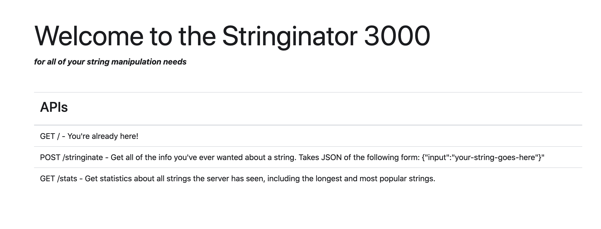

`/` is modifed to host an html using thymeleaf
 
 
`/api` serves for api list in json format

`/stats` are saved to and load from local file to keep the data persistent via Object Relational Mapping (ORM)
This could have been an H2 file database, or an actual database. 
This method was chosen for this time

An simple basic authentication added to demonstrate API security 

`username = comcastUser`

`password = awesome`

more sting manipulations were added to `POST /stringinate` 

swagger documantation is also added and available at

`/v2/api-docs` or `/swagger-ui.html` for ui version.

`Logger` is added as part of documentation and debugging

